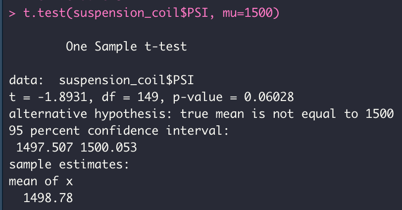
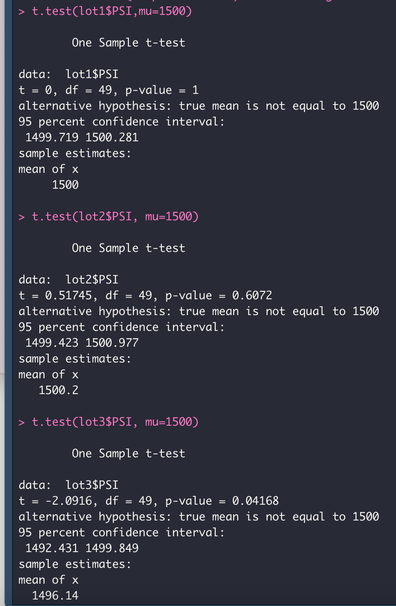

# MechaCar Statistical Analysis
## Linear Regression to Predict MPG

* According to the screenshot from my data above, it can be found that the Vehicle Length and the Ground Clearance provide a non-random amount of variance to the MPG Values
  * This means that these two variables have a p-value of less than 0.05.  This signifies that the variables (Vehicle Length and Ground Clearance) have a significant impact on the MPG of the MechaCar Model.
* According to the data above, it can be found that the slope of linear model is not zero and we can reject our null hypothesis.
  * This is because the p-value of our model is 5.35e-11 This number is is less than our signifance level of 0.05
* It could be said that this model does predict the MPG of the MechaCar Prototypes effectively
  * This is because the R-squared value of the model is 0.7149
  * This means that using this model about 71% of MPG predictions can be made. 
## Summary Statistics on Suspension Coils
* The design specifications for the MechaCar suspension coils say that the variance should not exceed 100 lbs per sq inch.  

* When looking at the total summary I created above, the variance is at 62.29, which is within the specifications.
* However when looking at the summary by manufacturing lot (below) you can see that manufacturing lot 3's variance is at 170.29, which is well above the specifications at 100.
* Manufacturing lot 3 is also driving up the varaiance for the other 2 manufacturing lots when one just looks at a total summary. 
* Lot 1 has a variance of 0.98 and Lot 2 has a variance of 7.47

## T-Tests on Suspension Coils
* See below for the results of the t.test I performed to see if the PSI across the manufacturing lots is statistically different than the population mean of 1500.

* From this test I found that the true mean of the sample is 1498.78, and that the p-value is 0.06.  Because the p-value is above the significance level of 0.05, we cannot reject the null hypothesis.  This means that all of the manufacturing lots are statistically similar to the population mean of 1500.
* To dive deeper, I performed the same t.test individually on each of the 3 manufacturing lots (see below):

* With lot 1 and lot 2, the results came back similar where to the 1st thest where the p-values were both greater tha 0.05, meaning that we cannot reject the null hypothesis and the manufacturing lots are statistically similar to the population mean of 1500.
* However with lot 3, the p-value came in at 0.04, which is below 0.05. This means that in this scenario we can reject the null hypothesis and say that the mean of this sample and the population mean are statistically different.
